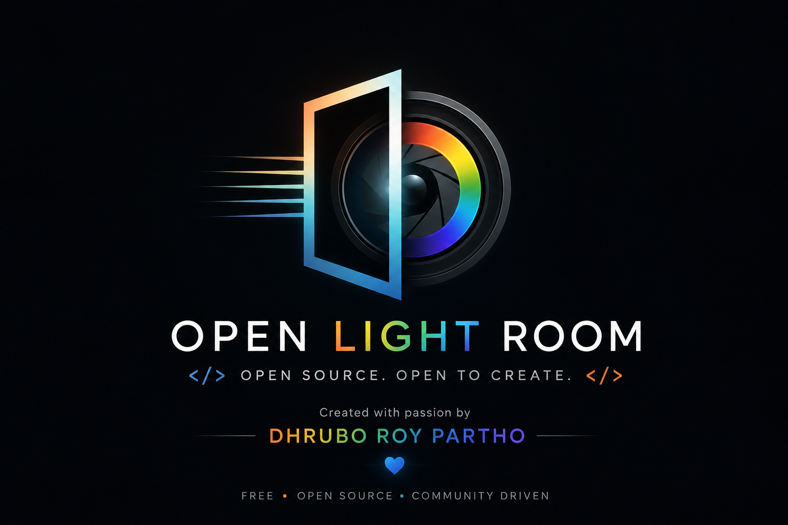

<p align="center">
  
</p>

<h1 align="center">Open LightRoom</h1>

<p align="center">
  A free, open source, non-destructive photo color-grading desktop app -
  built in Python with PySide6, in the spirit of Adobe Lightroom's Develop module.
</p>

<p align="center">
  <a href="https://github.com/DhruboRoyPartho/OpenLightRoom/issues">Report a bug</a>
  ·
  <a href="https://github.com/DhruboRoyPartho/OpenLightRoom/issues">Request a feature</a>
</p>

---

## Why this project exists

Professional-grade RAW photo editing is dominated by paid, closed-source
software. Open LightRoom is an attempt at a real alternative: a
non-destructive, layer-based color-grading engine with actual RAW
decoding (via LibRaw), a physically-grounded scene-linear color
pipeline, and a full local-adjustment/masking system - all free, all
readable, all yours to change.

It's also still young. If you've ever wanted to work on a real desktop
image editor - color science, native RAW decoding, custom Qt widgets,
performance-sensitive rendering pipelines - this is a project built to
be dug into, not just used.

## Features

**Import & non-destructive editing**
- RAW import via [LibRaw](https://www.libraw.org/) (`rawpy`) - CR2, CR3,
  NEF, ARW, DNG, RAF, ORF, RW2 - plus standard JPEG/PNG/TIFF/BMP/WEBP,
  with embedded ICC profile handling.
- Every edit is a non-destructive layer on top of an immutable base
  image; nothing is baked in until you export.
- Full undo/redo history, drag-gesture-aware (a slider drag is one undo
  step, not one per frame).
- Save/reopen a project's entire edit state (`.olrproj`).

**Color & tone**
- Basic tone: Exposure, Contrast, Highlights, Shadows, Whites, Blacks,
  Brightness.
- White balance: Temperature/Tint sliders plus a click-to-sample
  eyedropper, computed correctly in scene-linear light (not display
  bytes).
- Color: Vibrance, Saturation, Hue.
- 8-channel HSL grading (Hue/Saturation/Luminance per color band).
- Color Wheels (Shadows / Midtones / Highlights / Global lift-gamma-gain).
- Point curve and parametric curve tone tools.
- All processed on a physically-grounded float32 pipeline: RAW/scene
  data stays in linear light through White Balance and Exposure, then
  transforms to display-referred space for every perceptual tool - the
  usual cause of a "why does this look wrong" bug is mixing those two
  up, so keep that split in mind before touching any tone math.

**Masking (local adjustments)**
- Mask types: Brush, Radial, Linear Gradient, Rectangle, Ellipse,
  Polygon, Color Range, Luminance Range, Subject, Sky, Skin.
- Mask operations: Add / Subtract / Intersect, per-component Invert,
  whole-mask Invert / Feather / Blur / Density.
- Any number of masks per image, each with its own local Exposure,
  Contrast, Highlights/Shadows/Whites/Blacks, Temperature/Tint,
  Saturation, Hue.
- Direct on-canvas interaction: drag a shape's handles, paint a brush
  stroke, click out a polygon, drag a gradient's endpoints - with a
  live red overlay showing exactly where a mask currently applies.
- Subject/Sky detection are wired up as a pluggable AI interface (see
  [AI hooks](#ai-hooks-not-yet-implemented) below) - functional today
  via a safe whole-image fallback, ready for a real model to be dropped in.

**Geometry & composition**
- Crop, straighten (drag-a-line-to-level), rotate, flip - all
  non-destructive.

**Presets & scopes**
- Save/load/duplicate/import/export reusable presets (geometry and
  masks intentionally excluded - presets capture a reusable "look",
  not one photo's specific composition).
- Live histogram, waveform, vectorscope, and RGB parade.

**Performance & UX**
- Adjustable preview render quality (downscaled interactive preview)
  completely decoupled from export, which always renders at full
  resolution.
- Async render queue so dragging a slider never blocks the UI.
- A real menu bar (File/Edit/View/Help), Recent Projects, Preferences,
  and an About/Credits dialog - not just a bare canvas.

## Screenshots

_Coming soon - if you'd like to contribute a few, that's a genuinely
useful first PR. See [Contributing](#contributing)._

## Tech stack

| | |
|---|---|
| Language | Python 3.11+ (developed against 3.14) |
| GUI | [PySide6](https://doc.qt.io/qtforpython/) (Qt 6) |
| Numerics | [NumPy](https://numpy.org/), [OpenCV](https://opencv.org/) |
| RAW decoding | [rawpy](https://github.com/letmaik/rawpy) ([LibRaw](https://www.libraw.org/)) |
| Imaging / EXIF | [Pillow](https://python-pillow.org/), [piexif](https://github.com/hMatoba/Piexif), [exifread](https://github.com/ianare/exif-py) |
| Tests | [pytest](https://pytest.org/) - 479 tests as of this writing |

## Project structure

```
core/                   Pure logic - no Qt imports allowed here.
  image_model/            ImageDocument: base image, layer list, undo/redo.
  pipeline/                Stage/Pipeline: render order as data, not hardcoded logic.
  processing/              Per-tool pixel math (exposure, contrast, HSL, curves, ...).
  color_science/           Color-space primitives (XYZ, Lab, OKLab/OKLCH, primaries).
  adjustment_layers/       One class per tool, composed onto ImageDocument.
  masking/                 Mask shape generators + Mask/MaskComponent combination logic.
  commands/                Undo/redo command objects.
  io/                      RAW/EXIF/image/project/preset file I/O.
  scopes/                  Histogram/waveform/vectorscope/parade data generation.
  threads/                 Async render queue/worker.
  ai/                      Pluggable AI engine interfaces (Subject/Sky/etc. - see below).

interface/gui/          PySide6 widgets. Talks to core/ only through
                         ImageDocument, Commands, and core's pure
                         functions - holds no color math of its own.

tests/                  Mirrors core/ and interface/gui/ by feature area.
```

The one architectural rule worth internalizing before sending a PR:
**`core/` never imports from `interface/`, and holds no Qt code.**
Every tool's actual math lives in `core/processing/`, is unit-tested
without ever opening a window, and the GUI layer is a thin, replaceable
skin on top of it.

## Getting started

```bash
git clone https://github.com/DhruboRoyPartho/OpenLightRoom.git
cd OpenLightRoom

python -m venv .venv
.venv\Scripts\activate          # Windows
# source .venv/bin/activate     # Linux/macOS (see note below)

pip install -r requirements.txt
python main.py
```

> **Platform note:** development currently targets Windows. The
> Python/Qt/NumPy/OpenCV stack itself is cross-platform, and running
> from source on Linux/macOS is expected to mostly work, but it isn't
> regularly tested there yet - see [Roadmap](#roadmap--known-limitations).

## Running the tests

```bash
# offscreen avoids popping real windows during the GUI test suite
set QT_QPA_PLATFORM=offscreen        # PowerShell: $env:QT_QPA_PLATFORM="offscreen"
python -m pytest -q
```

Please run the full suite before opening a PR, and add tests for new
`core/` logic - that's where this project's actual confidence comes
from. GUI-facing changes have test coverage too (driven via direct
method calls rather than synthetic Qt events - see existing tests
under `tests/gui/`, `tests/masks/` for the established pattern).

## AI hooks (not yet implemented)

`core/ai/` defines a real interface for pluggable ML-backed features -
Subject mask, Sky mask, auto-grade, color match, color analysis - each
with a documented contract and a safe default (e.g. Subject/Sky
currently fall back to selecting the whole image, rather than silently
doing nothing, when no model is registered). No actual model ships with
the project. If you want to contribute a real implementation behind one
of these interfaces, start in `core/ai/registry.py`.

## Roadmap / known limitations

- **No packaged builds published yet.** Running from source (above) is
  the only supported way to use the app right now.
- **AI features are interface-only** (see above) - a good place for a
  meaningful contribution if you work with ML.
- **No `LICENSE` file yet.** This is an open source project in spirit
  and intent (see the tagline above), but a formal license hasn't been
  chosen and added yet. If you're a contributor with opinions here,
  open an issue - this should get resolved early.
- **No `CONTRIBUTING.md`/CI pipeline yet either.** Until those exist,
  the short version: open an issue before a large change, keep PRs
  focused, run the test suite, follow the existing code's structure
  (pure logic in `core/`, Qt in `interface/gui/`).

## Contributing

Issues and pull requests are genuinely welcome, including "beginner"
ones - documentation fixes, adding tests, UI polish, and reporting bugs
are just as valuable as new features.

1. Open an issue first for anything nontrivial, so effort doesn't go to
   waste on something that's already being worked on or doesn't fit.
2. Keep `core/` free of Qt/GUI imports - that boundary is what makes the
   color/masking engine testable and reusable.
3. Add or update tests for what you change; run the full suite before
   submitting.
4. Match the surrounding code's structure and naming rather than
   introducing a new pattern for the same kind of thing.

## Acknowledgments

Built on the shoulders of [Qt](https://www.qt.io/)/[PySide6](https://doc.qt.io/qtforpython/),
[NumPy](https://numpy.org/), [OpenCV](https://opencv.org/),
[LibRaw](https://www.libraw.org/)/[rawpy](https://github.com/letmaik/rawpy),
[Pillow](https://python-pillow.org/), and the many photographers and
open source photo tools whose ideas this project draws on.

## Author

**Dhrubo Roy Partho**
[GitHub](https://github.com/DhruboRoyPartho) ·
[LinkedIn](https://www.linkedin.com/in/dhrubo-roy-partho/) ·
dhruboroypartho@gmail.com
